---

## About

I'm Varun Sharma, a Mathematics and Computer Science student at UC San Diego with a minor in Cognitive Science, graduating in March 2027. I build software across cloud infrastructure, applied AI, and full-stack product development.

My experience spans hardware telemetry coverage at AWS, LLM-powered candidate search at AI Fund, document processing at Planck AI, and computer vision for robotics at Integem. I enjoy turning complex data and workflows into tools that engineers and users can act on.

**Open to:** conversations about software engineering, applied AI, and full-stack development.

## Tech Stack

### Languages

Python · JavaScript · TypeScript · SQL · Java · C · C++ · R · MATLAB · Bash

### Frontend

React · Next.js · Tailwind CSS · HTML/CSS · Cloudscape

### Backend & Databases

Supabase · Postgres · GraphQL · Edge Functions · REST APIs · Flask · FastAPI

### Cloud, DevOps & Tooling

AWS CDK · ECS Fargate · S3 · Glue · Athena · IAM · VPC · CI/CD · Vercel · Apify

### AI / ML Frameworks

OpenAI API · Gemini · TensorFlow · PyTorch · FAISS · PDFPlumber · LayoutParser · PaddleOCR

## Featured Projects

<strong>Healthcare Patient Scheduling Chatbot</strong>

A conversational scheduling application that matches patients with therapists based on patient needs and therapist specialties.

| Attribute | Details |
| :--- | :--- |
| Stack | React, Supabase, OpenAI API, Google Calendar API |
| Scale | Patient-facing chatbot and administrative dashboard |
| Performance | Real-time conversational responses; no published latency benchmark |
| Security | Prototype; authentication and access controls need review before production use |
| Impact | Explores conversational patient intake, therapist matching, and calendar booking workflows |
| Repository | [View source](https://github.com/varunsharma101/healthcare-chatbot) |

Built in May 2025, this prototype combines conversational intake, Supabase-backed therapist records, and Google Calendar integration. The current implementation parses assistant responses as text; scheduling needs further work before production use.

<strong>NeuralVault · Semantic File Search & Knowledge Graph</strong>

A desktop knowledge explorer that connects files through semantic similarity and presents them in an interactive 3D graph.

| Attribute | Details |
| :--- | :--- |
| Stack | Python, Flask, Next.js, TypeScript, Gemini, LanceDB, Three.js |
| Scale | Recursive desktop indexing across text, code, images, PDFs, and media metadata |
| Performance | Incremental embedding skips files already processed; no published latency benchmark |
| Security | Local vector storage; selected file content is processed by the Gemini API |
| Impact | Makes related files discoverable through semantic search and community visualization |
| Repository | [View source](https://github.com/varunsharma101/knowledge-graph-builder) |

Combines vector search, similarity links, and community detection with a navigable file graph. Natural-language queries support exploration beyond filenames and folder structure.

<strong>Voice-to-Slide · Recording-to-Presentation Pipeline</strong>

An application that turns an MP4 recording into an editable PowerPoint through transcription, outline generation, and themed slide rendering.

| Attribute | Details |
| :--- | :--- |
| Stack | Python, FastAPI, React, Whisper, OpenAI API, moviepy, python-pptx |
| Scale | End-to-end video upload, transcript review, slide outline, and presentation export |
| Performance | Job progress tracking throughout processing; no published throughput benchmark |
| Security | Audio is sent to the OpenAI transcription API; transcript text is sent for slide outlining |
| Impact | Automates the path from recorded content to an editable slide deck |
| Repository | [View source](https://github.com/varunsharma101/voice-to-slide) |

Separates transcription from slide generation so users can review the transcript and outline before downloading. Includes four presentation themes and a React interface for the complete workflow.

[Browse all repositories →](https://github.com/varunsharma101?tab=repositories)

## GitHub Analytics

## Contribution Activity

<picture>
  <source media="(prefers-color-scheme: dark)" srcset="https://raw.githubusercontent.com/varunsharma101/varunsharma101/output/github-snake-dark.svg?v=7" />
  <source media="(prefers-color-scheme: light)" srcset="https://raw.githubusercontent.com/varunsharma101/varunsharma101/output/github-snake.svg?v=7" />
  
</picture>

## Connect

---

*Build with clarity. Measure the result. Make the next iteration better.*

