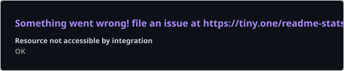

<div align="center">


<a href="https://github.com/varunsharma101"></a>


[](https://portfolio-geometric.vercel.app)
[](https://www.linkedin.com/in/varun-c-sharma/)
[](mailto:vas001@ucsd.edu)
[](https://github.com/varunsharma101)


[](https://github.com/varunsharma101?tab=followers)
[](https://github.com/varunsharma101?tab=repositories)

</div>

---

## About

I'm Varun Sharma, a Mathematics and Computer Science student at UC San Diego with a minor in Cognitive Science, graduating in March 2027. I build software across cloud infrastructure, applied AI, and full-stack product development.

My experience spans hardware telemetry coverage at AWS, LLM-powered candidate search at AI Fund, document processing at Planck AI, and computer vision for robotics at Integem. I enjoy turning complex data and workflows into tools that engineers and users can act on.

**Open to:** conversations about software engineering, applied AI, and full-stack development.

## Tech Stack

### Languages

[](https://github.com/varunsharma101?tab=repositories)

Python · JavaScript · TypeScript · SQL · Java · C · C++ · R · MATLAB · Bash

### Frontend

[](https://github.com/varunsharma101/portfolio)

React · Next.js · Tailwind CSS · HTML/CSS · Cloudscape

### Backend & Databases

[](https://github.com/varunsharma101?tab=repositories)

Supabase · Postgres · GraphQL · Edge Functions · REST APIs · Flask · FastAPI

### Cloud, DevOps & Tooling

[](https://github.com/varunsharma101?tab=repositories)

AWS CDK · ECS Fargate · S3 · Glue · Athena · IAM · VPC · CI/CD · Vercel · Apify

### AI / ML Frameworks

[](https://github.com/varunsharma101?tab=repositories)

OpenAI API · Gemini · TensorFlow · PyTorch · FAISS · PDFPlumber · LayoutParser · PaddleOCR

---

## AI / ML Expertise

| Domain | Proficiency | Details |
| :--- | :--- | :--- |
| LLM applications | Applied internship experience | Natural-language search, structured outputs, SQL filter generation, and two-stage candidate ranking |
| Document intelligence | Applied internship experience | PDF extraction, OCR, layout analysis, and table processing for LLM workflows |
| Computer vision | Applied internship experience | TensorFlow classification, data augmentation, confidence thresholds, and deployment on edge hardware |
| AI product development | Project experience | OpenAI function calling, therapist matching, scheduling integrations, and administrative interfaces |

---

## Featured Projects

<details open>
<summary><strong>Healthcare Patient Scheduling Chatbot</strong></summary>

A conversational scheduling application that matches patients with therapists based on patient needs and therapist specialties.

| Attribute | Details |
| :--- | :--- |
| Stack | React, Supabase, OpenAI API, Google Calendar API |
| Scale | Patient-facing chatbot and administrative dashboard |
| Performance | Real-time conversational responses; no published latency benchmark |
| Security | Supabase Auth and Google OAuth integration, as documented in the repository |
| Impact | Automated appointment booking and centralized inquiries, sessions, availability, and conflict detection |
| Repository | [View source](https://github.com/varunsharma101/healthcare-chatbot) |

Built in May 2025, the application uses OpenAI function calling for structured matching decisions and Google Calendar integration for appointment scheduling. The admin dashboard brings booking and availability workflows into one interface.

</details>

<details>
<summary><strong>NeuralVault · Semantic File Search & Knowledge Graph</strong></summary>

A desktop knowledge explorer that connects files through semantic similarity and presents them in an interactive 3D graph.

| Attribute | Details |
| :--- | :--- |
| Stack | Python, Flask, Next.js, TypeScript, Gemini, LanceDB, Three.js |
| Scale | Recursive desktop indexing across text, code, images, PDFs, and media metadata |
| Performance | Incremental embedding skips files already processed; no published latency benchmark |
| Security | Local vector storage; selected file content is processed by the Gemini API |
| Impact | Makes related files discoverable through semantic search and community visualization |
| Repository | [View source](https://github.com/varunsharma101/knowledge-graph-builder) |

Combines vector search, similarity links, and community detection with a navigable file graph. Natural-language queries support exploration beyond filenames and folder structure.

</details>

<details>
<summary><strong>Voice-to-Slide · Recording-to-Presentation Pipeline</strong></summary>

An application that turns an MP4 recording into an editable PowerPoint through transcription, outline generation, and themed slide rendering.

| Attribute | Details |
| :--- | :--- |
| Stack | Python, FastAPI, React, Whisper, OpenAI API, moviepy, python-pptx |
| Scale | End-to-end video upload, transcript review, slide outline, and presentation export |
| Performance | Job progress tracking throughout processing; no published throughput benchmark |
| Security | Whisper transcription runs locally; transcript text is sent to OpenAI for outlining |
| Impact | Automates the path from recorded content to an editable slide deck |
| Repository | [View source](https://github.com/varunsharma101/voice-to-slide) |

Separates transcription from slide generation so users can review the transcript and outline before downloading. Includes four presentation themes and a React interface for the complete workflow.

</details>

[Browse all repositories →](https://github.com/varunsharma101?tab=repositories)

---

## Experience

### Software Development Engineer Intern · Amazon Web Services
**June 2026 – September 2026 · Cupertino, CA**

Built tooling that makes hardware telemetry processing coverage visible and actionable for engineers.

- Replayed real hardware events through production rule-processing libraries to identify coverage gaps.
- Deployed infrastructure using AWS CDK, ECS Fargate, S3, Glue, Athena, an isolated VPC, and IAM roles.
- Integrated the pipeline with CI/CD to keep coverage generation aligned with production rule changes.
- Built a React and Cloudscape dashboard backed by GraphQL and Athena.
- Identified **33,000 telemetry events without matching parsing rules** and **12 unreachable configurations**.

`AWS` `CDK` `ECS Fargate` `S3` `Glue` `Athena` `React` `Cloudscape` `GraphQL` `CI/CD`

### AI Engineer Intern · AI Fund
**July 2025 – May 2026 · Mountain View, CA**

Built AI-assisted recruiting workflows and full-stack tools for program operations.

- Developed natural-language search across approximately **20,000 candidates**, combining SQL filters with a two-stage LLM matching and reranking workflow.
- Reduced LLM cost by **55%** and search latency from **four minutes to one minute**.
- Built a profile ingestion pipeline using Apify, OpenAI structured outputs, and Supabase Postgres.
- Created the Buildathon website, applicant portal, and internal review dashboard.

`OpenAI API` `SQL` `React` `JavaScript` `Tailwind CSS` `Supabase` `Postgres` `Apify`

### Data Validation Intern · Planck AI
**March 2025 – July 2025 · Remote**

Built document processing pipelines that extract structured data for LLM workflows.

- Combined PDFPlumber, LayoutParser, and PaddleOCR to extract text, tables, and embedded images.
- Handled scanned and table-heavy PDFs through OCR, layout analysis, and specialized table detection.
- Created visualizations to diagnose parsing errors and verify extraction quality.

`Python` `PDFPlumber` `LayoutParser` `PaddleOCR` `OCR` `Document Processing`

### Artificial Intelligence & AR Project Intern · Integem
**June 2024 – September 2024 · Cupertino, CA**

Developed computer vision and AR components for robotics projects.

- Retrained and deployed a lightweight TensorFlow image classifier for a robot pickup workflow.
- Improved object recognition accuracy by approximately **10%** using targeted augmentation, confidence thresholds, and learning-rate scheduling.
- Trained models on NVIDIA Jetson Nano and built Python AR game components for Raspberry Pi-based robots.

`Python` `TensorFlow` `Computer Vision` `NVIDIA Jetson Nano` `Raspberry Pi`

---

## Achievements

<div align="center">

| Recognition | Details |
| :--- | :--- |
| Academic performance | **3.9 / 4.0 GPA** at UC San Diego |
| Provost Honors | **2023–2026** |
| Education | B.S. Mathematics and Computer Science; minor in Cognitive Science; expected March 2027 |

</div>

---

## Certifications

No certifications listed. My applied experience and academic recognition are detailed above.

---

## Coding Profiles

[](https://github.com/varunsharma101?tab=repositories)

Additional coding-platform profiles are not listed.

---

## GitHub Analytics

<div align="center">

<a href="https://github.com/varunsharma101"></a>
<a href="https://github.com/varunsharma101"></a>

<a href="https://github.com/varunsharma101?tab=repositories"></a>

</div>

---

## GitHub Trophies

<div align="center">

<a href="https://github.com/varunsharma101"></a>

</div>

---

## Contribution Activity

[View my live contribution calendar and recent activity on GitHub →](https://github.com/varunsharma101?tab=overview)

---

## Contribution Snake

<div align="center">


</div>

---

## Current Focus

```yaml
learning:
  - Algorithms, machine learning, and database systems
building:
  - Cloud tooling and full-stack AI applications
exploring:
  - Semantic search and knowledge graphs
  - Practical LLM workflows and developer tools
open_to:
  - Software engineering conversations
  - Applied AI and full-stack collaboration
```

---

## Connect

<div align="center">

[](mailto:vas001@ucsd.edu)
[](https://www.linkedin.com/in/varun-c-sharma/)
[](https://github.com/varunsharma101)
[](https://portfolio-geometric.vercel.app)

</div>

---

<div align="center">

*Build with clarity. Measure the result. Make the next iteration better.*


</div>
